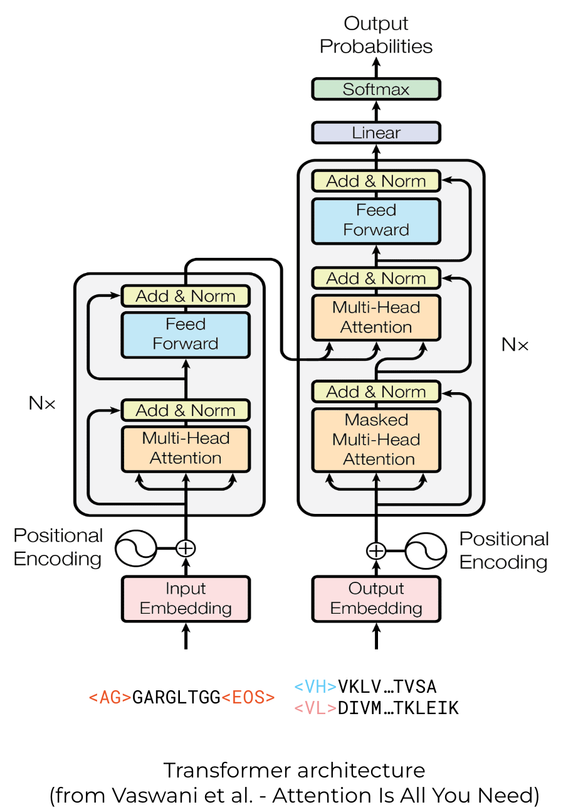

# Antigen-Aware Antibody Design (A3D)

## Summary
This repo contains code for training a T5 transformer on a SAbDab dataset to generate Fv-fragment of antibody given the linear epitope sequence of the target antigen.

Epitope is represented as amino acid sequence of linear epitope segment (includes most of the contacts residues)


Model architecture: vanilla transformer encoder-decoder mapping linear epitope sequence to VH+VL sequence:



Model performance is measured by aligning the generated sequence to the native antibody from antibody-antigen complex and calculating the percentage of matched amino acids in different regions: FRs, CDRs, paratope

Example:
```
                                     ..X.XX.* *              * ......
Reference: -VQLQQSGAELVK-PGASVKLSCTASGFNIKDTYMYWVKQRPEQGLEWIGRIDPANGDT...
            |||.||||| || ||||||.||.|||......|||||.|.|.|||||.|||.||||||
Generated: QVQLVQSGAE-VKKPGASVKVSCKASGYTFTSYYMYWVRQAPGQGLEWMGRIGPANGDT...
FR Score: 0.7755, CDR Score: 0.6818, Paratope Score: 0.7273

Notation:
  `.` - CDR
  `X` - Contact in CDR
  `*` - Contact outside CDR
```

Table below summarizes amino acid reconstruction accuracy across the validation set for CDRs and paratope regions for VH and VL:

|    |  CDR | Paratope |
|----|-----:|---------:|
| VH | 44.9 |     46.0 |
| VL | 50.8 |     43.9 |

## Usage
### Create conda environment

```bash
conda env create -f environment.yaml
conda activate a3d
```

### Inference
Refer to `inference.ipynb` on how to run inference with a trained model.

### Training

#### 1. Obtain and preprocess SAbDab dataset
Visit SAbDab [website](https://opig.stats.ox.ac.uk/webapps/newsabdab/sabdab/search/?all=true#downloads)

Download an archive of all structures to `data/` directory and extract it.
You will also need summary tsv file, place it in `data/` as well.

NB: of course you can place data elsewhere, but in this case you'll need to adjust the arguments of the preprocessing script

Run preprocessing:
```python
python scripts/process_sabdab.py
```

#### 2. Run training
Training arguments are configured with [Hydra](https://hydra.cc/), for details look into `conf/train.yaml`.

Run training script:
```bash
python scripts/train.py
```

Track training with [Aim](https://aimstack.readthedocs.io/en/latest/):
```bash
cd logs/a3d
aim up
```
